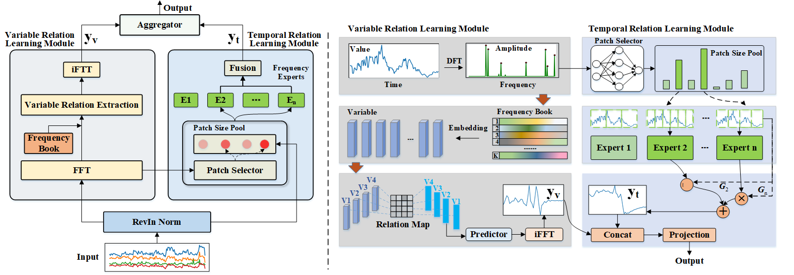

# TimeART
## Introduction
In this paper, we propose a pre-trained foundation model TimeART for multivariate time series forecasting, which elaborates a disentangled structure to capture the temporal relation and variable relation separately, and is proven to be effective from theoretical analysis and extensive experiments. In the temporal relation leaning module, we design a multi-expert architecture that offers customized models to tackle the division patches at specific patch sizes, where the time series could choose multiple experts since they may consist of various frequency components. The outputs of individual experts are subsequently integrated so that the complex temporal dependency would be well explored. In the variable learning module, we propose to utilize a frequency book to obtain the variable representations and excavate their relation. Finally, the disentangled results obtained from the temporal relation and the variable relation modules are aggregated to generate the final prediction. We pre-train the TimeART on the collected dataset with 1.6 billion time points. Extensive experiments on public real datasets demonstrate that our framework achieves superior performance.

## Model architecture



## Run


- step 1: create a new conda environment  
```
conda create -n TimeART python==3.9.12  
conda activate TimeART
```

- step 2: install all the python package, all package is list in requirements.txt
```
pip install -r requirements.txt
```

- step 3: create the logs directory and run run.sh
```
mkdir logs  
sh run.sh
```